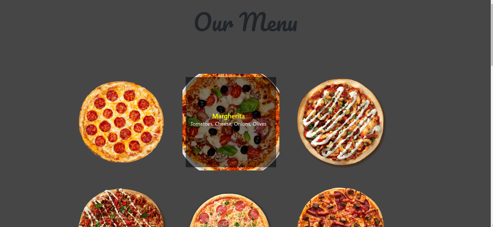
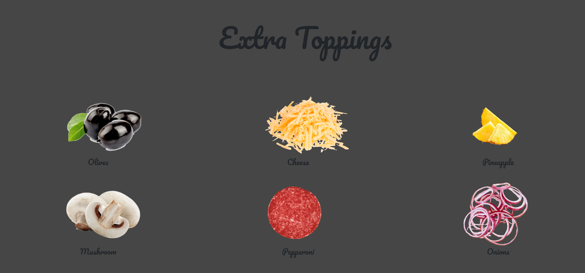
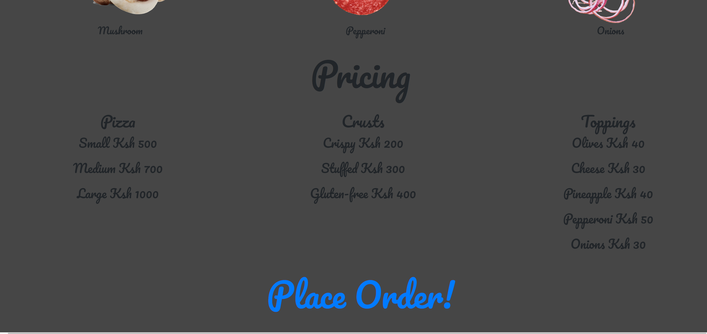
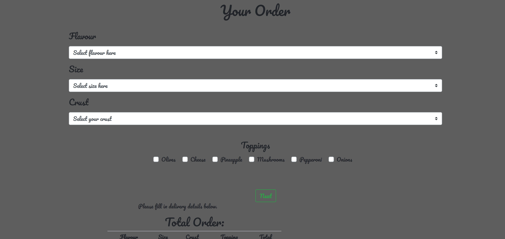
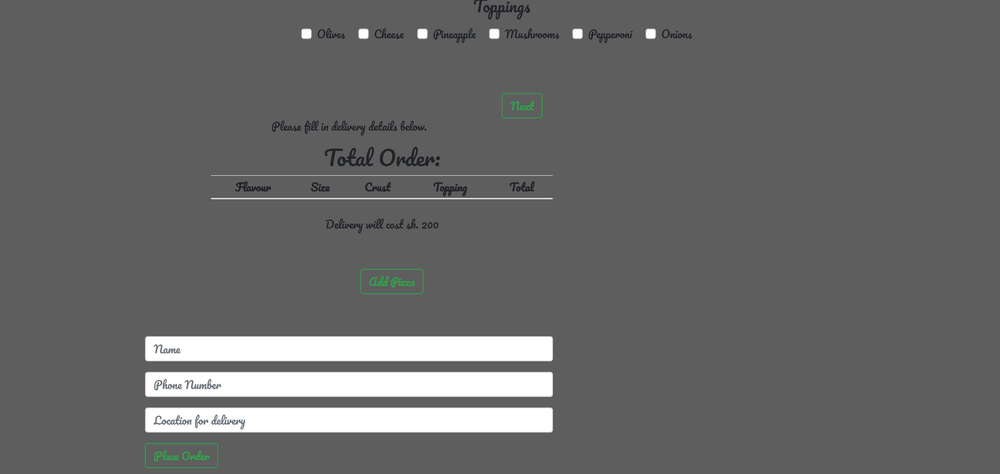

### PIZZA APP
This is a web app that allows a user to order pizza and choose from a variety of options from which crust to have, the flavour and the different toppings that they can add. It also allows an optin for the user to get the Pizza delivered to them and pay a small fee depending on the location.

## AUTHOR
Nicollette Ochola

## TECHNOLOGIES USED
- HTML
- CSS (Bootstrap)
- JAVASCRIPT (jQuery 3.4.1)

## Set up instructions
- Have a good internet connection
- Fork the ripository to your own git hub account
- Clone the repository to your local machine
- Open the folder, index.html on your browser 

## BEHAVIOUR DRIVEN DEVELOPMENT
- Behaviour : 
Choose from the landing page if you want to make an order or see the menu first.

From the menu, see the different types of pizza by hovering over the images.

Make your order by selecting the options provided on the form.
Click on the Place your order link to lead to the order form

 - Input :
User puts in their preffered choices from the options provided
Select a delivery option if it's the users preference to have the pizza delivered

- Output :
Have a summmary of the order and the total price to be paid

## KNOWN BUGS 
The User can only order one Pizza at a time, when the add pizza option is selected, the page reloads.
## LINK TO LIVE SITE 
https://nicolletteochola.github.io/PizzaApp/

## CONTACT DETAILS
- email: nicoleochola@gmail.com
- Number: 0726868063
## LICENCE
MIT Licence Copyright (c) (Nicollette Ochola)
